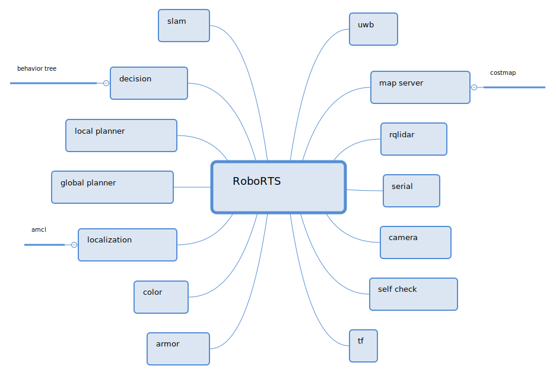

# SJTU 2019 ICRA

## Documents

- Official website: https://www.robomaster.com/zh-CN/robo/icra
- Official framework: https://github.com/RoboMaster/RoboRTS
- Zhihu ICRA 2018: https://www.zhihu.com/question/60659273
- CSDN:
  - Setup: https://blog.csdn.net/qq_30193419/article/details/81842704
  - TX2: https://blog.csdn.net/qq_30193419/article/details/81221645
  - YOLOv3: https://blog.csdn.net/qq_30193419/article/details/82460870
  - Jetpack: https://blog.csdn.net/gx768233721/article/details/81279647
  - UART: https://blog.csdn.net/gx768233721/article/details/82951709

- Simulator NJUST: https://github.com/jackychen227/ICRA2018_DJI_RM_AI_Challenge_NJUST

- hopai: https://github.com/DavidGogh/hopai

- Reinforcement Learning: http://rail.eecs.berkeley.edu/deeprlcourse/

- Slam:
  - gazebo: http://gazebosim.org/

- ROS tutor:
  - https://legacy.gitbook.com/book/sychaichangkun/ros-tutorial-icourse163/details

- Simple Simulator:
  - code tank: http://codetank.alloyteam.com/

## Environment

ROS in docker: https://github.com/pierrekilly/docker-ros-box

## TODO

(我的理解可能和官方真实用处有出入，欢迎大家仔细阅读后一起讨论)

- decision: 制作模拟器，在整车出来前用于试验。
- driver: 相机驱动，需要解决权限问题，参考RM2018大符。
- detection: 复用RM自瞄，包装一下，要求稳定。依赖driver。
- localization: 视觉或激光雷达定位，官方示例使用amcl，需要使用激光雷达复现。依赖map，laser。
- map: 储存障碍物信息，官方示例使用costmap，需要复现。作为库使用，不单独生成node。
- planning: 全局和局部路径规划，需要复现。依赖map。

### 熟悉模块

1. 运行入口在哪里？具体是哪个node？可以参考CMakeLists.txt中的add_executable。
2. 订阅了哪些topic？发布了哪些topic？这些topic又对应到哪些node？
3. 依赖少的基础模型，在实物上复现。依赖多的基础模型，伪造topic复现。
4. 最好自己从头写一遍。至少照着敲一遍。
5. 刚开始不要纠结于具体算法，先实现功能，发现不足再改进算法。